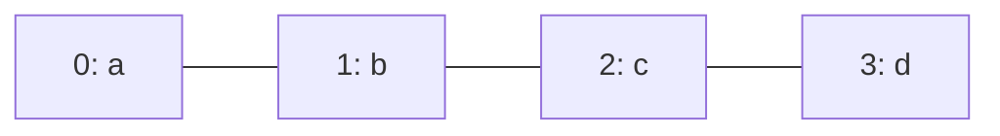

# Array

Kind: DS

## What
Fixed-length contiguous block of slots. Index `i` is address arithmetic, so access is O(1).

## Picture



Index `i` → address `base + i * size`. Drop a png in `attachments/` and replace this block with `![[array.png]]` if you want a drawn figure.

## Must know
- Layout is contiguous. That is why scans are cache-friendly and why insert/delete in the middle costs O(n) shifts.
- Access O(1). Search O(n) unless sorted.
- Insert / delete at an arbitrary index O(n).
- Length is part of the structure. Out-of-range is your bug, not a feature.
- Loses to [[Dynamic array]] when the size is not known up front.
- Loses to [[Hash table]] when you need lookup by key, not by index.
- Loses to [[Singly linked list]] when you splice in the middle and already hold the node — and even then only if you do not need index access.

## Pseudocode

```
ACCESS(A, i):
    return A[i]

SCAN(A):
    for i ← 0 to A.length - 1:
        visit(A[i])

INSERT(A, i, x):      // needs spare capacity
    for j ← A.length down to i + 1:
        A[j] ← A[j - 1]
    A[i] ← x
    A.length ← A.length + 1

DELETE(A, i):
    for j ← i to A.length - 2:
        A[j] ← A[j + 1]
    A.length ← A.length - 1
```

## Related
- Next: [[Dynamic array]]
- Holds: [[String]], [[Matrix]], [[Bitset]]
- Algorithms on it: [[Linear search]], [[Binary search]], [[Merge sort]], [[Two pointers]], [[Sliding window]], [[Prefix sums]]
- Go: `ds/array` in dsa-go
