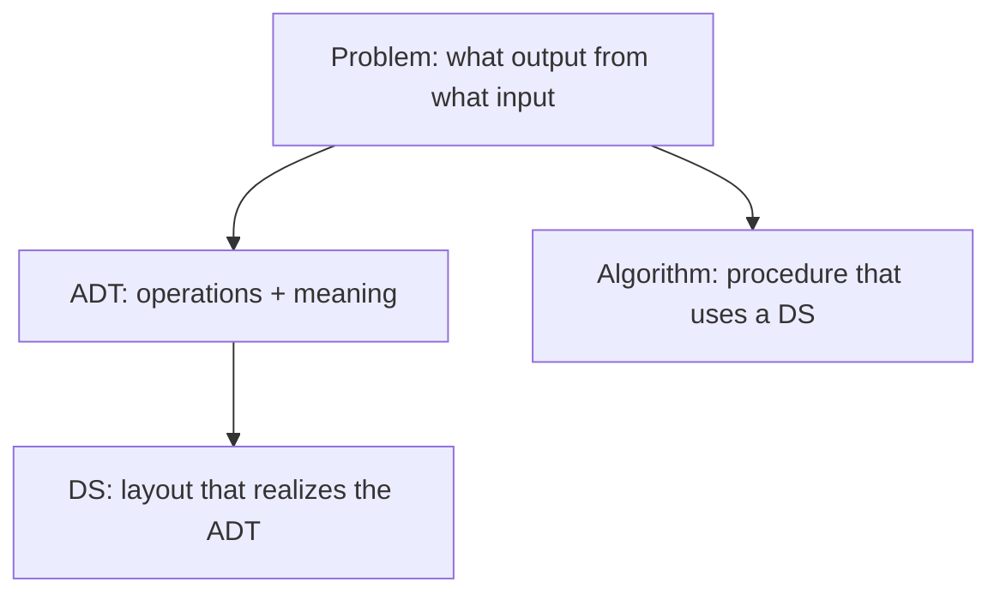

## What
Four words people collapse. Keep them apart or every later note gets muddy.

## Picture



## Must know
**Problem.** Input spec, output spec, constraints. “Given `n` integers, return the k-th smallest.” Not a structure.

**ADT (abstract data type).** A contract: operations and what they mean. No layout.
- [[Stack]]: push / pop / peek, LIFO.
- [[Queue]]: enqueue / dequeue, FIFO.
- [[Priority queue]]: insert / find-min / delete-min.
- Dictionary: insert / lookup / delete by key.

Several DS can implement one ADT. [[Priority queue]] can be an unordered array, a [[Binary heap]], or a [[Fibonacci heap]]. The ADT did not change. The bounds did.

**Data structure.** The layout. Fields, indexes, pointers, invariants.
- [[Array]] is a DS. “List” as an ADT can be an array or a linked list.
- Invariant is part of the DS. “Every node’s key ≥ its parent” is a heap, not a wish.

**Algorithm.** A procedure that terminates and produces the spec. It *uses* a DS. [[Dijkstra]] is an algorithm. It needs a [[Priority queue]] ADT. Swap the heap and the time bound changes; the algorithm idea does not.

Why this split matters:
- “I will use a heap” is a DS choice. “Extract min repeatedly” is the algorithm.
- Complexity belongs to a pair: algorithm + implementation of the ADT it calls.
- Interview question “implement a queue with two stacks” is ADT vs DS on purpose.

Space of the ADT vs extra space of the algorithm: say which. In-place sort mutates the input DS.

## Pseudocode

```
ADT PriorityQueue:
    INSERT(x)
    FIND-MIN() → x
    DELETE-MIN() → x

// one realization: binary heap  (DS)
// another: sorted array        (DS)
// Dijkstra calls the ADT, not the heap code
```

## Related
- Next: [[Asymptotic notation]], then [[Array]]
- Used by: every DS note (the ADT it serves) and every algo note (the ADT it calls)
