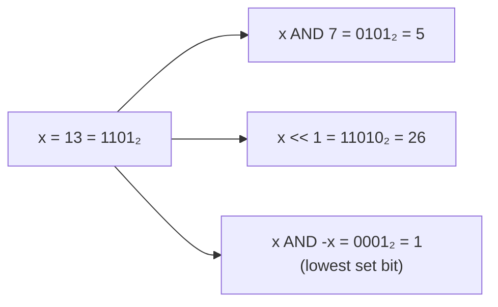

## What
Integer operations that run in O(1) on a machine word. The layer under [[Bitset]], masks, and a lot of CP tricks.

## Picture



## Must know
Assume a two's-complement word of width `w` (64 on modern machines). Then `+ − AND OR XOR NOT << >>` on a word are O(1) in the RAM model.

Core ops:

| Op | Meaning | Use |
|---|---|---|
| `x & y` | bits set in both | mask |
| `x \| y` | bits set in either | union of flags |
| `x ^ y` | bits that differ | toggle, xor-swap, xor-list |
| `~x` | flip all bits | |
| `x << k` | multiply by `2^k` (if no overflow) | |
| `x >> k` | divide by `2^k` (logical vs arithmetic) | |
| `x & 1` | lowest bit | parity |
| `x & (x−1)` | clear lowest set bit | Kernighan popcount step |
| `x & −x` | isolate lowest set bit | Fenwick index math |
| `x \| (x+1)` | set lowest zero | |

Identities that matter:
- `x ^ x = 0`, `x ^ 0 = x`. XOR of a range, or of all elements, cancels pairs. That is the “single number” problem.
- `x + y = (x ^ y) + 2(x & y)`. Rarely needed; know XOR is add-without-carry.
- Signed right shift on two's complement fills 1s. In Go, `>>` on signed is arithmetic.

Popcount = number of 1-bits. Hardware `POPCNT` is O(1). Kernighan loop is O(number of 1s).

[[Bitset]] is an array of words. Scan / union / intersect are `Θ(n / w)`, which is why bitsets beat bool arrays.

Masks in DP: [[Bitmask enumeration]] walks subsets of an `n`-element universe in `O(2ⁿ · poly)`. Submasks of `m`:

```
s = m
do
    use s
    s = (s - 1) & m
while s ≠ m          // after 0 it wraps to m
```

Fenwick tree index updates use `i += i & −i`. You do not need to love bits to use that line, but you should know what it does: jump to the next responsibility range.

What bits are *not*: a replacement for real number theory. Overflow is still a bug. Shifting into or past `w` is undefined in C; in Go shifts are well-defined and cut modulo word size for the shift count.

## Pseudocode

```
POPCOUNT(x):                          // O(#set bits)
    c ← 0
    while x ≠ 0
        x ← x & (x - 1)
        c ← c + 1
    return c

LOWEST_SET(x):
    return x & -x

IS_POWER_OF_TWO(x):
    return x > 0 and (x & (x - 1)) = 0
```

## Related
- Needs: [[Asymptotic notation]], [[Comparison model vs RAM]]
- Used by: [[Bitset]], [[Fenwick tree]], [[Bitmask enumeration]], [[Dynamic programming]]
