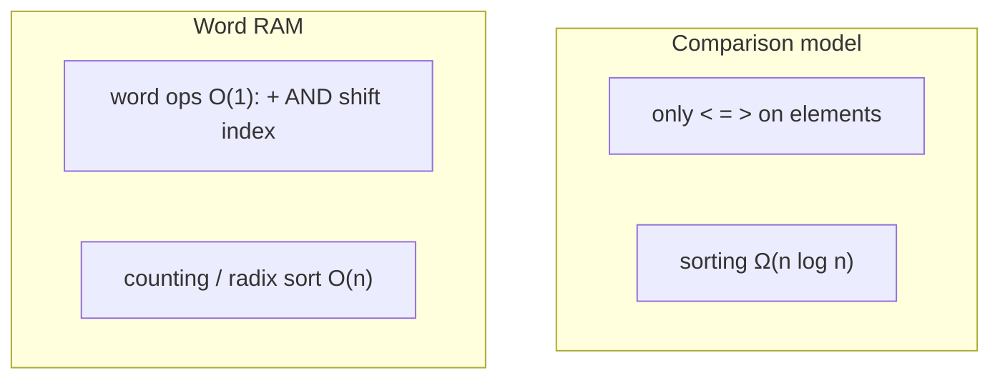

## What
Two cost models. Which one you are in decides whether `Ω(n log n)` is a law or a suggestion.

## Picture



## Must know
**Comparison model.** You may only compare elements. Each comparison costs 1. Memory access is free or ignored. Decision tree of height = worst-case comparisons. There are `n!` orders, so any correct comparison sort does `Ω(log n!) = Ω(n log n)` comparisons. That is why [[Merge sort]] / [[Heap sort]] are optimal *as comparison sorts*.

**Word RAM.** The model CLRS uses for most “linear-time” claims. A word holds `Θ(log n)` bits (enough to store an index). Arithmetic, bitwise ops, and array access on a word are O(1). Now you may *inspect bits of keys*, not only compare them.

Consequences:
- [[Counting sort]] is `O(n + k)` for keys in `{0..k−1}`. Legal in RAM. Illegal as a comparison sort.
- [[Radix sort]] is `O(d(n + σ))` for `d` digits. Beats `n log n` when keys are short integers.
- Hashing expected O(1) assumes RAM + a hash that behaves.
- [[van Emde Boas tree]] / fusion trees live in RAM on a universe `U` packed into words.

**Pointer machine.** Nodes + pointers. No random-access array of size `n` unless you build it. Linked-list results are often in this model. Some lower bounds (union-find) are pointer-machine bounds.

**External / I/O model.** Cost is block transfers, not CPU. Why [[B-tree]] / [[B+ tree]] exist. Different course. Know the name.

Which model to state:
- Interview default: RAM, word size large enough for an index. Comparison lower bound still applies *if you only compare*.
- If you use extra key structure (integers in a small range, strings over a fixed alphabet), say so. That is how you justify beating `n log n`.

Space is also model-dependent. “In-place” usually means `O(1)` extra words besides the input, in RAM.

## Pseudocode

```
COMPARISON-MIN(A):                    // legal in both models, Θ(n) compares
    m ← A[0]
    for i ← 1 to A.length - 1
        if A[i] < m: m ← A[i]
    return m

COUNTING-SORT(A, k):                  // RAM, keys in 0..k-1, Θ(n + k)
    C ← array of k zeros
    for each x in A: C[x] ← C[x] + 1
    i ← 0
    for v ← 0 to k - 1
        repeat C[v] times
            A[i] ← v
            i ← i + 1
```

## Related
- Needs: [[Asymptotic notation]], [[Bits]]
- Used by: [[Counting sort]], [[Radix sort]], [[Merge sort]], [[Hash table]], [[van Emde Boas tree]]
