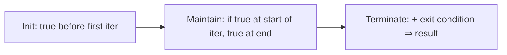

## What
A claim that is true before and after every iteration. The tool that proves an iterative algorithm correct, the same way induction proves a recurrence.

## Picture



## Must know
Three obligations. Miss one and you do not have a proof.

1. **Initialization.** The invariant holds before the first iteration (usually after setup).
2. **Maintenance.** If it holds at the start of an iteration, the body re-establishes it at the end.
3. **Termination.** When the loop exits, the invariant plus the exit condition give the thing you wanted.

The invariant must be *strong enough* to imply correctness at the end, and *weak enough* to be true at the start. That is the design tension.

Classic: [[Insertion sort]] on `A[1..n]` (1-based as in CLRS).

- Invariant: `A[1..i−1]` is sorted and contains the original elements of that prefix.
- Init: `i = 2`, prefix of length 1 is sorted.
- Maintain: insert `A[i]` into the prefix. Prefix grows by one and stays sorted.
- Terminate: `i = n+1`, so `A[1..n]` is sorted.

Same pattern for:
- [[Binary search]]: `A[lo..hi]` still contains the target if it exists.
- Array scan for max: `m` is the max of `A[0..i−1]`.
- [[Prefix sums]]: `S[i] = A[0] + … + A[i]`.
- Partition in [[Quicksort]]: left of `i` ≤ pivot, right of `j` ≥ pivot.

A loop without an invariant is a hope. If you cannot state one in one sentence, you do not yet understand the loop.

Invariants are not comments you sprinkle after the fact. Write them *before* the index arithmetic.

## Pseudocode

```
INSERTION-SORT(A):
    // invariant: A[0..i-1] sorted, same multiset as original prefix
    for i ← 1 to A.length - 1
        key ← A[i]
        j ← i - 1
        while j ≥ 0 and A[j] > key
            A[j + 1] ← A[j]
            j ← j - 1
        A[j + 1] ← key
    // i = n, so A[0..n-1] is sorted
```

## Related
- Needs: [[Asymptotic notation]]
- Next: [[Recurrences]], then every iterative algo
- Used by: [[Insertion sort]], [[Binary search]], [[Prefix sums]], [[Quicksort]]
