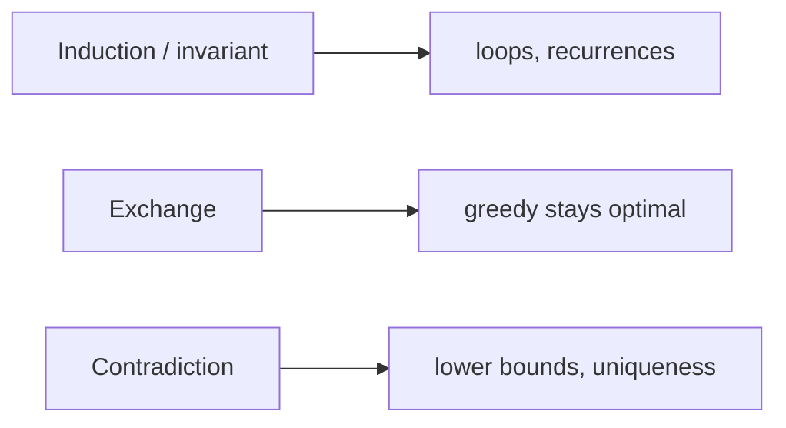

## What
The three proof moves DSA actually uses. Correctness is not “it passed three tests.”

## Picture



## Must know
**Induction.** Same engine as [[Loop invariants]] and [[Recurrences]].
- Base: true for the smallest `n` (or empty structure).
- Step: assume for smaller instances / earlier iterations, prove for this one.
- Strong induction: assume *all* smaller, not just `n−1`. Tree proofs need this.
- If the inductive statement is too weak, the step fails. Strengthen it (add a bound, add “and the prefix is a heap”).

**Exchange argument.** The greedy proof.
- Take an optimal solution `O` and your greedy solution `G`.
- If they differ at the first place, swap `O` toward `G` without losing cost.
- Repeat. `O` becomes `G`. So greedy is optimal.
- Used by activity selection, Huffman, MST exchange ([[Kruskal]], [[Prim]]).
- If you cannot write the swap, you do not have a greedy proof. “Looks locally best” is not a proof.

**Contradiction.**
- Assume the opposite. Derive something impossible (a shorter path, a cycle in a DAG, more than `n!` leaves in a short decision tree).
- Comparison-sort lower bound is this: a tree of height `< log₂ n!` cannot have `n!` leaves.
- Uniqueness claims (one MST under distinct weights) are usually contradiction + exchange.

Also useful, smaller:
- **Stay-ahead.** After `i` steps, greedy is at least as good as any other algorithm after `i` steps. Close cousin of exchange.
- **Cut and paste.** Same as exchange on structures (trees, paths).
- **Potential** is a proof about *cost*, not correctness — [[Amortized analysis]].

What to write down for any algorithm:
1. Invariant or inductive claim.
2. Why termination happens.
3. Complexity in [[Asymptotic notation]], with the model from [[Comparison model vs RAM]].

## Pseudocode
Not an algorithm. Skeleton for a greedy proof:

```
EXCHANGE(G, O):
    i ← first index where G and O differ
    x ← G[i], y ← O[i]
    O' ← O with y swapped for x
    show cost(O') ≤ cost(O)
    and O' agrees with G on one more position
    repeat until O' = G
```

## Related
- Needs: [[Loop invariants]], [[Asymptotic notation]]
- Used by: [[Greedy]], [[Kruskal]], [[Prim]], [[Merge sort]], [[Dynamic programming]]
