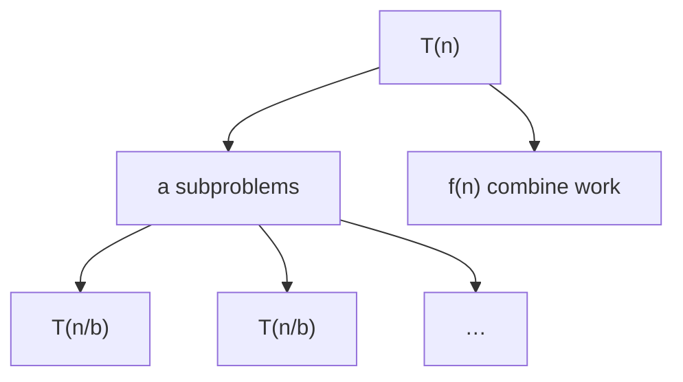

## What
An equation for `T(n)` in terms of smaller `T`. How you get Big-O out of recursion and [[Divide and conquer]].

## Picture



## Must know
Standard form:

`T(n) = a T(n/b) + f(n)`, `T(1) = Θ(1)`

- `a ≥ 1` number of recursive calls
- `b > 1` shrink factor
- `f(n)` work outside the recursive calls (split + combine)
- Critical exponent: `c_crit = log_b a`. Subproblem tree has `Θ(n^{c_crit})` leaves.

Three ways to solve:

**1. Recursion tree.** Draw levels. Cost per level × number of levels. Sum. Best intuition.

**2. Substitution.** Guess `T(n) ≤ d n^k`, prove by induction. You must strengthen the guess if constants do not close (often subtract a lower-order term).

**3. Master theorem** (CLRS form), for `T(n) = a T(n/b) + f(n)`:

- Case 1: `f(n) = O(n^{log_b a − ε})` for some `ε > 0` → `T(n) = Θ(n^{log_b a})`. Leaves dominate.
- Case 2: `f(n) = Θ(n^{log_b a} log^k n)` for `k ≥ 0` → `T(n) = Θ(n^{log_b a} log^{k+1} n)`. (The common `k = 0` line is `Θ(n^{log_b a} log n)`.)
- Case 3: `f(n) = Ω(n^{log_b a + ε})` and regularity `a f(n/b) ≤ c f(n)` for some `c < 1` and large `n` → `T(n) = Θ(f(n))`. Root dominates.

If `f` sits in a gap between cases, Master does not apply. Use the tree or Akra–Bazzi (rare in interviews).

Standard results you should know cold:

| Recurrence | Algorithm | T(n) |
|---|---|---|
| `T(n) = T(n/2) + Θ(1)` | [[Binary search]] | `Θ(log n)` |
| `T(n) = T(n − 1) + Θ(1)` | linear recursion | `Θ(n)` |
| `T(n) = 2 T(n/2) + Θ(n)` | [[Merge sort]] | `Θ(n log n)` |
| `T(n) = T(n − 1) + Θ(n)` | [[Insertion sort]] recurse, or selection | `Θ(n²)` |
| `T(n) = T(n/2) + T(n/2) + Θ(1)` | naive tree walk of a balanced tree | `Θ(n)` |
| `T(n) = 2 T(n/2) + Θ(1)` | some tree builds | `Θ(n)` |
| `T(n) = T(n − 1) + T(n − 2) + Θ(1)` | naive Fibonacci | `Θ(φⁿ)` |

Uneven splits: [[Quicksort]] expected `T(n) = (2/n) Σ T(i) + Θ(n)` → `Θ(n log n)`. Worst partition `T(n) = T(n−1) + Θ(n)` → `Θ(n²)`.

Space of recursion is the *depth* of the call stack, not the tree size. Merge sort depth `O(log n)` extra besides the temp buffer.

## Pseudocode

```
MERGESORT(A, lo, hi):                 // T(n) = 2 T(n/2) + Θ(n)
    if lo ≥ hi: return
    mid ← ⌊(lo + hi) / 2⌋
    MERGESORT(A, lo, mid)
    MERGESORT(A, mid + 1, hi)
    MERGE(A, lo, mid, hi)             // Θ(hi - lo + 1)
```

Tree: `log n` levels, `Θ(n)` work each level → `Θ(n log n)`.

## Related
- Needs: [[Asymptotic notation]], [[Loop invariants]] (for the combine step)
- Paradigm: [[Divide and conquer]], [[Recursion]]
- Used by: [[Merge sort]], [[Quicksort]], [[Binary search]], [[Recursion]]
